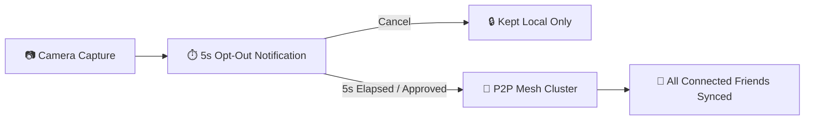

<div align="center">

# 🐧 PENGUIN

**Decentralized, Privacy-First Group Photo Sharing for Android**

[](https://developer.android.com)
[](https://openjdk.org)
[](https://m3.material.io)
[](https://developers.google.com/nearby/connections/overview)
[](LICENSE)

*Instantly share group photos in real-time over a direct peer-to-peer mesh. Zero cloud storage. Zero servers. Complete privacy.*

---

### 📥 [Download Ready-to-Install APK](release/penguin.apk)
*Pre-built, signed debug APK ready to install directly on Android devices.*

---

</div>

## 📌 Overview

**PENGUIN** is a native Android application built for effortless group photo sharing during trips, parties, and events.

Instead of uploading high-res photos to third-party cloud servers or suffering compression in messaging apps, PENGUIN creates a local, encrypted mesh network between nearby phones using **Google Nearby Connections (`P2P_CLUSTER`)**.

---

## ✨ Key Features

- ⚡ **100% Offline & Direct** — High-speed device-to-device transfers over Wi-Fi Direct and Bluetooth. No internet, mobile data, accounts, or cloud servers required.
- 🛡️ **5-Second Privacy Buffer** — Every photo you take triggers a 5-second heads-up notification with a **"Cancel Sync"** action before anything is shared.
- 📷 **Omnidirectional QR Pairing** — Join sessions in seconds by scanning the host's QR code from any angle (or entering the 6-character room code).
- 📷 **Camera-Only Detection** — Only watches for newly taken camera photos (`DCIM/Camera`) while a session is active. Never scans personal folders, screenshots, or downloads.
- 🔄 **Self-Healing Offline Sync** — If a friend walks out of range, photos are queued automatically and backfilled the moment they reconnect.
- 👤 **Custom Nicknames** — Set your display name and assign custom nicknames to other session members locally on your device.
- 🎨 **Material Design 3** — Clean, modern dark theme with live connectivity pills and a 3-column shared gallery.

---

## 🚀 How It Works



1. **Create or Join a Session**:
   - **Host**: Tap **Create Session**, enter a session name, and share the QR code or 6-character room code.
   - **Joiner**: Tap **Join Session**, scan the QR code (from any angle) or enter the room code.
2. **Take Photos**: Snap photos with your favorite camera app.
3. **Automatic Sync**: The 5-second countdown notification appears. If you don't cancel it, the photo streams directly to everyone in the room!

---

## 📱 Hardware & Permission Requirements

To allow Android to discover and connect nearby phones offline, make sure these are toggled **ON** in your phone's Quick Settings:

| Setting | Why It's Needed |
|---|---|
| **Bluetooth** | Used for local peer discovery and handshake beacons. |
| **Wi-Fi** | Used for high-speed offline Wi-Fi Direct photo transfers *(no router or internet connection needed)*. |
| **Location** | Android OS requirement for offline Wi-Fi Direct & Bluetooth device discovery *(PENGUIN never tracks or shares GPS data)*. |

---

## 📦 Direct Download & Installation

1. Download **[`release/penguin.apk`](release/penguin.apk)** directly to your Android device.
2. Open the downloaded `.apk` file and allow *"Install from unknown sources"* if prompted.
3. Launch **Penguin**, allow the requested permissions, and start sharing!

---

## 🛠️ Tech Stack

| Layer | Technologies |
|---|---|
| **Platform** | Android 8.0+ (API 26–34), Java 17 |
| **UI & Theming** | Material Design 3 (Dark Theme), View Binding |
| **Networking** | Google Play Services Nearby Connections (`P2P_CLUSTER`) |
| **Database** | AndroidX Room (SQLite) |
| **Media & Imaging** | Bumptech Glide 4.16, AndroidX ExifInterface |
| **QR Code Engine** | ZXing Core & Embedded Scanner (Omnidirectional) |

---

## 🔨 Building from Source

```bash
# Clone the repository
git clone https://github.com/arcolenux/Automatic-media-sharing.git
cd Automatic-media-sharing

# Build debug APK
./gradlew assembleDebug
```

The APK will be generated at `app/build/outputs/apk/debug/penguin.apk` and `release/penguin.apk`.

---

## 📄 License

Licensed under the [Apache License 2.0](LICENSE).
