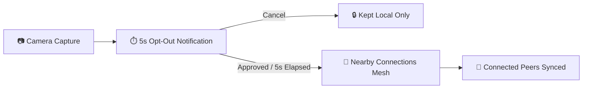

<div align="center">

# 🐧 PENGUIN

**Decentralized, Privacy-First Group Photo Sharing for Android**

[](https://developer.android.com)
[](https://openjdk.org)
[](https://m3.material.io)
[](https://developers.google.com/nearby/connections/overview)
[](LICENSE)

*Instantly share group photos in real-time over a local peer-to-peer mesh. Zero cloud storage. Zero servers. Complete privacy.*

---

</div>

## 📌 Overview

**PENGUIN** is a native Android application built for seamless, device-to-device group photo sharing during trips, events, and gatherings. 

Instead of uploading photos to third-party cloud servers or dealing with compression in messaging apps, PENGUIN creates an encrypted local mesh network between nearby phones using **Google Nearby Connections (`P2P_CLUSTER`)**.

---

## ✨ Key Features

- ⚡ **Zero Cloud Dependency** — Direct device-to-device transfers over Wi-Fi Direct and Bluetooth. No backend servers, databases, or accounts needed.
- 🛡️ **5-Second Privacy Buffer** — Every captured photo triggers a 5-second notification with a **"Cancel Sync"** action before anything leaves your device.
- 📷 **Camera-Only Scope** — Only detects newly captured camera photos (`DCIM/Camera`) while a session is active. Never scans personal galleries, screenshots, or downloads.
- 🔄 **Self-Healing Sync** — Out-of-range members are never dropped. When reconnected, devices automatically exchange photo inventories and backfill missing media.
- 🎨 **Material Design 3** — Clean, responsive dark theme with real-time sync badges (`Queued`, `Syncing`, `Synced`).
- ⚡ **Frictionless Pairing** — Join sessions in seconds via QR code scan or an unambiguous 6-character room code.

---

## 🚀 How It Works



1. **Host or Join** — One device creates a session (generating a QR code and a 6-character room code); nearby devices scan or type the code to connect.
2. **Snap Photos** — Take pictures normally using any camera app.
3. **Review & Sync** — A 5-second opt-out notification appears. If not canceled, the photo is securely streamed directly to all session members.

---

## 🛠️ Tech Stack

| Layer | Technologies |
|---|---|
| **Platform** | Android 8.0+ (API 26–34), Java 17 |
| **UI & Theming** | Material Design 3 (Dark Theme), View Binding |
| **Networking** | Google Play Services Nearby Connections (`P2P_CLUSTER`) |
| **Database** | AndroidX Room (SQLite) with schema versioning |
| **Media & Imaging** | Bumptech Glide 4.16, AndroidX ExifInterface |
| **QR Code Engine** | ZXing Core & Embedded Scanner |

---

## 📦 Project Structure

```text
com.penguin.app
├── activity/       # Material 3 UI (Main, CreateSession, JoinSession, Session)
├── adapter/        # 3-column shared gallery RecyclerView adapter
├── db/             # Room database, DAOs, and type converters
├── model/          # Session, photo, receipt, and transfer payload models
├── notification/   # 5-second privacy timer and opt-out receiver
├── observer/       # MediaStore ContentObserver for DCIM/Camera
├── service/        # Background data synchronization service
├── transfer/       # Nearby Connections manager, offline queue, and sync
└── util/           # QR generator, permission resolver, and file utilities
```

---

## 🔨 Building from Source

### Prerequisites
- Android Studio Hedgehog (2023.1.1) or newer
- JDK 17 or JDK 21
- Android SDK Platform 34

### Build & Run
```bash
# Clone the repository
git clone https://github.com/arcolenux/Automatic-media-sharing.git
cd Automatic-media-sharing

# Build debug APK
./gradlew assembleDebug

# Run unit tests
./gradlew test
```

The debug APK will be generated at `app/build/outputs/apk/debug/app-debug.apk`.

---

## 🔒 Privacy & Permissions

PENGUIN operates strictly locally and requests only permissions necessary for on-device detection and local radio transmission:

- **Camera** — Required only to scan host QR codes.
- **Photos / Media** — Required to detect newly taken photos in `DCIM/Camera`.
- **Nearby Devices & Bluetooth** — Required for peer discovery and high-speed local data transfer.
- **Notifications** — Required to display the 5-second privacy opt-out banner.

---

## 📄 License

This project is licensed under the Apache License 2.0. See [LICENSE](LICENSE) for details.
